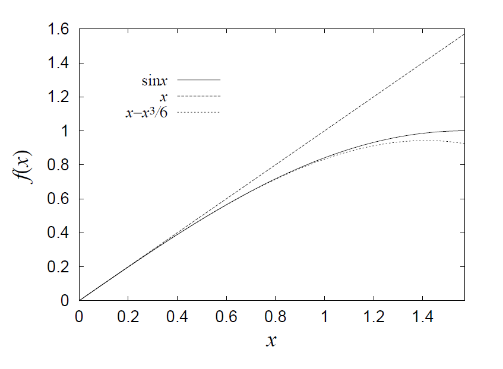

# 第一回 次元解析とテイラー展開

## 目的

物理数学の基礎として、すべての量に次元があること、近似はどのように行うかを理解する。

## 解答

### 1. (1)

バネ定数$k$のバネにつながれた質量$m$の質点の振動周期を$T$としよう。
振幅は初期状態に依存するであろうが、振動周期は$k$及び$m$だけで決まるであろう。
そこで、

$$
  T \sim k^{\alpha} m^{\beta}
$$

とおいて、次元が合うように$\alpha$、$\beta$を決めることを考える。このような方法を **次元解析 (dimensional analysis)** と呼び、物理的な解析の第一歩である。

質量は基本単位であるから次元は$[M]$である。同様に振動周期の次元も時間$[T]$となる。

問題はバネ定数$k$の次元であるが、バネ定数は力と距離を結びつける定数であるから、

$$
  F = k x
$$

より、

$$
  [M L/T^2] = k[L]
$$

である。したがってバネ定数の次元は$[M/T^2]$でなくてはならない。以上より、$k^\alpha m^\beta$の次元は、$[M^{\alpha+\beta} T^{-2\alpha}]$である。これが$[T]$に等しくなくてはならないから、$\alpha = -1/2, \beta = 1/2$、すなわち、

$$
  T \sim \sqrt{\frac{m}{k}}
$$

と分かる。このことから、バネの振れ方は質量が大きくなるほどゆっくりに(周期が大きく)なり、その遅くなり方は質量の平方根に比例することなどが微分方程式を解かずともわかる。

### 1. (2)

まず、振動周波数の次元は$[1/T]$である。よく$[Hz]$(ヘルツ)という単位で呼ばれる。長さの次元は$[L]$、質量は$[M]$、重力は加速度であるから$[L/T^2]$である。
これらから、

$$
\begin{aligned}
  \left[1/T \right] &= [L^\alpha] [M^\beta] [M^\gamma L^\gamma T^{-2\gamma}]\\
  T^{-1} &= L^{\alpha+\gamma} M^{\beta} T^{-2\gamma}
\end{aligned}
$$

この式から、$\alpha = -1/2, \beta = 0, \gamma = 1/2$が分かる。以上から、

$$
  \omega \sim \sqrt{\frac{g}{l}}
$$

が分かる。長さが長くなれば振れ方が遅くなり、重力が強ければ早くなるという
直感に合う結果となった。さらに、**周波数が質量に依存しない** ということも分かる。何か問題に取り組むとき、ある物理量が他の物理量にどのように依存するべきかを考えることが非常に重要である。

### 2. (1)

ボールの運動は二次元的であるので、二つの自由度があればよい。鉛直方向を$y$、水平方向を$x$とすると、運動方程式はそれぞれ、

$$
\begin{aligned}
  m\ddot{x} &= 0\\
  m\ddot{y} &= -mg
\end{aligned}
$$

となる。これは二階微分方程式だが、運動量$p_x,p_y$を導入して、

$$
\begin{aligned}
  \dot{p_x} &= 0\\
  \dot{p_y} &= -mg \\
  \dot{x} &= \frac{p_x}{m}\\
  \dot{y} &= \frac{p_y}{m}
\end{aligned}
$$

と、連立一階微分方程式に落とすこともできる。

### 2. (2)

全エネルギー$E$は、運動エネルギー$K$と位置エネルギー$U$に分けることができる。
それぞれ

$$
\begin{aligned}
  K &= \frac{1}{2m} \left( p_x^2 +  p_y^2 \right)\\
  U &= mgy
\end{aligned}
$$

運動エネルギーの次元は、$[m^{-1}][p^2]$であるので、$[M^{-1} (ML/T)^2]$、整理して
$[M L^2 T^{-2}]$である。
また、位置エネルギーの次元は$[m][g][y]$であるから、
$[M LT^{-2} L]$より、整理すれば$[M L^2 T^{-2}]$となり、次元が一致することが確かめられた。

### 2. (3)

前問で求めたとおり、全エネルギーは

$$
  E = \frac{1}{2m} \left( p_x^2 +  p_y^2 \right) + mgy
$$

である。時間微分すると、

$$
\begin{aligned}
  \dot{E} &= \frac{1}{m} ( p_x \underbrace{\dot{p_x}}_{0} +  p_y \underbrace{\dot{p_y}}_{-mg}) + mg\underbrace{\dot{y}}_{p_y/m} \\
  &= - p_y g + p_y g\\
  &= 0
\end{aligned}
$$

となり、保存することが確かめられた。余談だが、一階微分方程式の形で運動方程式を書いておいたほうが、保存量などの計算の見通しが立ちやすくなる。一階の時間微分を、運動方程式にしたがって書き直すだけでよいからだ。

### 2. (4)

距離を$\theta$の関数としてあらわし、$\theta$で微分して$0$となる点を求めればよい。答えは$\theta = \pi/4$と知っているであろうが、それをきちんと求めるのが本問題の趣旨である。

$y$方向の運動方程式の一般解は、

$$
  y(t) = - \frac{g}{2} t^2 + \dot{y}(0)t + y(0)
$$

である。初期位置は$y(0)=0$であり、
$y$方向の初速は$V_0 \sin \theta$であるから、解は

$$
  y(t) = - \frac{g}{2} t^2 + V_0 t \sin \theta
$$

となる。$t>0$で$y=0$となるのは、

$$
  t = \frac{2 V_0}{g} \sin \theta
$$

この時間だけ$x$方向に一定速度$V_0 \cos \theta$で進むのであるから、落ちるまでに進む距離$L$は、

$$
  L = \frac{2 V_0^2}{g} \sin \theta \cos \theta
$$

である。あとは

$$
2 \sin \theta \cos \theta = \sin 2\theta
$$

と、その微分から、$\theta = \pi/4$のときに最大値を取ることが分かる。ここで、最大飛距離となる角度が、初速$V_0$によらない事に注意したい。空気抵抗がある場合など、一般には最大飛距離となる角度は初速に依存する。

### 3.

$$
  f(x) = c_0 + c_1 (x-x_0) + c_2 (x-x_0)^2 + \cdots
$$

この式が恒等式となるためには、どんな$x$の値についても成り立たなくてはならない。そこで、まず$x=x_0$を代入しよう。すると、

$$
  f(x_0) = c_0
$$

である。次に、両辺を$x$で微分してから$x=x_0$を代入すると、

$$
  f'(x_0) = c_1
$$

と係数を決めることができる。二回微分すると、$(x-x_0)^2$の項から
係数$2$が出てくるので、

$$
  f''(x_0) = 2 c_2
$$

より、

$$
  c_2 = \frac{f''(x_0)}{2}
$$

となり、一般に$c_k$は$k$階微分$f^{(k)}(x)$を用いて、

$$
  c_k = \frac{f^{(k)}(x_0)}{k!}
$$

とあらわされる。以上をまとめると、テイラー展開の公式、

$$
  f(x) = \sum_{k=0} \frac{f^{(k)}(x_0)}{k!} (x-x_0)^k
$$

を得る。以上の導出から、なぜ階乗が出てくるかなどが理解できるであろう。くれぐれもこの公式(に限らず公式一般に言えることだが)を暗記してはいけない。
公式は自分で導けてはじめて使ってよい。

### 4. (1)

$$
\begin{aligned}
  \sin x &= x - \frac{x^3}{3!} + \frac{x^5}{5!} - \cdots \\
  &= \sum_{n=1} \frac{(-1)^{n-1}}{(2n-1)!} x^{2n-1}
\end{aligned}
$$

ここで$\sin x$は奇関数であるから、原点に関するテイラー展開では、奇数次の項しか出てこないことに注意すること。

### 4. (2)

$$
\begin{aligned}
  \cos x &= 1 - \frac{x^2}{2!} + \frac{x^4}{4!} - \cdots \\
  &= \sum_{n=0} \frac{(-1)^{n}}{(2n)!} x^{2n}
\end{aligned}
$$

$\sin$と同様な理由から、偶数次の項のみ出てくることに注意すること。

### 4. (3)

$$
\begin{aligned}
  \ln (1+x) &= x - \frac{x^2}{2} +  \frac{x^3}{3} - \cdots\\
  &= \sum_{n=1} \frac{(-1)^{n+1}}{n}x^n
\end{aligned}
$$

$\ln x$を$x=0$の周りで展開できないことに注意しよう。また、できれば$\ln x$のグラフを思い描き、$x=1$のまわりで、展開一次の係数が正であること、さらに二次の係数が負であることくらいまでは考えて分かるようにしたい。

### 5.

自分が行った近似がどの程度良いものか、具体的な値を代入して確かめることは非常に重要である。いろいろ確かめるうちに、テイラー展開を低次で打ち切っても元の関数を良く再現する場合と、高次まで取らないと再現しない関数があることに気が付くだろう。ここでは例として、$\sin$を取り上げる。

前問で触れたとおり、$\sin$の原点周りのテイラー展開は、

$$
  \sin x = x - \frac{x^3}{3!} + \frac{x^5}{5!} - \cdots 
$$

である。展開を1次で打ち切ると、$\sin x \sim x$であり、3次まで取ると、$\sin x \sim x - x^3/6$である。特に$x=\pi/2$を代入した場合、もとの関数では$1.00$、1次まででは$\pi/2 \sim 1.57$、3次まで取ると$(\pi/2) - (\pi/2)^3/6 \sim 0.92$と急速に近似が良くなることが分かる。

## 解説

### 次元

物理数学においてもっとも重要なことは、すべての量に単位があるということである。
単位は、たとえば長さ$[m]$だったり、エネルギー$[J]$だったりするだろう。
このような単位を、物理では **次元(dimension)** と呼ぶ。

物理数学において絶対に気をつけて欲しいことは
**次元の異なる量を足したり引いたりしない**ということだ。１メートルのものと３キログラムのものを足す、ということは全くのナンセンスである。次元の異なる量の加減算をしないということに気をつけるだけで、計算ミスをかなり減らすことができる。次元の異なる量を掛けたり割ったりすることはできる。その場合、結果の次元ももとの量の次元を掛けたり割ったりしたものになる。

たとえば速度を考えよう。速度は、ある距離$[m]$を進むのにかかった時間$[s]$であるので、次元はメートル毎秒$[m/s]$などとなる。このように次元は角括弧$[]$で表現する。物理で扱う基本的な次元は、長さ$[L]$、質量$[M]$、時間$[T]$、電流$[A]$などであり、加速度や力など、他の物理量はこれらの組み合わせで表すことができる[^1]。

[^1]: 本文で述べた４つの次元には、それぞれメートル(m)、キログラム(k)、秒(s)、アンペア(A)という単位が定義されており、合わせてMKSA単位系と呼ぶ。このMKSA単位系のほかに、国際単位系(SI)で決まっている単位では、他に温度(ケルビン)、物質量(モル)、光度(カンデラ)が
定義されており、この７つを基本単位と呼ぶ。

次元の異なるものを足してはならないという制限から、
指数関数、対数といった**初等超越関数の引数には次元のある量をいれてはならない**。要するに指数関数の肩に何か物理量が乗る場合には、同じ次元を持つ量で無次元化してやらねばならない。

たとえば、何か物理量$A$が指数関数的に減衰していく状況を考えよう。この場合、漸近的な振る舞いは

$$
  A \sim \exp(-t/\tau)
$$

と書けるだろう。また、量子力学で井戸型ポテンシャルに閉じ込められた
電子の波動関数の、ポテンシャルへのしみ出しが、

$$
  \Psi \sim \exp(-x/\lambda)
$$

などとなることを学んだはずだ。それぞれ時間の次元、長さの次元のある量が指数関数の肩に乗るために、同じ次元の量$\tau$や$\lambda$が$t$や$x$を無次元化しているのがわかるだろう。これらを特徴的な量と呼ぶ。たとえば、$\tau$を**緩和時間 (characteristic time もしくは decay time)**、$\lambda$を **特徴的な長さ (characteristic length)**などと呼び、物理においては
スケールを特徴付ける重要な量である。

### 運動方程式と保存量

物理が微分方程式を解く学問であることはすでに述べた。物理の問題を考える上では、まず系の支配方程式(governing equation)を考えることから始まる。その中で、質点系が従う方程式が **運動方程式 (equation of motion)**と呼ばれ、Newtonにより定式化された微分方程式である。運動方程式は、力学の問題における支配方程式である。質点系は扱う対象が不連続であるが、後に流体など連続量を扱う微分方程式も扱う。その場合には **場 (field)**という考え方が重要となる。

運動方程式は、外力$F$が運動量$p$の時間変化をもたらすことをあらわすもので、以下のように記述される。

$$
  \dot{p} = F
$$

ただし、

$$
  \dot{p} \equiv \frac{\mathrm{d} mq}{\mathrm{d} t}
$$

である($q$は座標)[^pq]。

[^pq]: 力学では慣例として、運動量を$p$、座標を$q$であらわす。解析力学ではより一般に、系の状態を決めるパラメータを一般化座標$q$、対応する一般化運動量を$p$としてハミルトンの運動方程式を定式化する。このあたりは解析力学の授業でやったはずである。

時間微分をこのように物理量の上にドットを記して表すやりかたはNewtonによって導入されたものだ。$p = mv$であり、速度$v = \dot{x}$であるから、一般に質量が変化しない場合は、

$$
  m \ddot{x} = F
$$

と表される。
この方程式は「力と加速度が比例し、その比例定数が物質の質量である」ということを表している。時間微分が二階微分であることに注意すること。この微分方程式の解は、
時間反転に対して対称である。すなわち、$f(t)$が解であれば、必ず$f(-t)$も解となる。この時間反転対称性は、時間の矢とは何かという問題を提起し、大いにBoltzmannを苦しめた。なお、速度に比例する摩擦など、散逸項がある場合には時間反転対称ではなくなる。

ある物理量$A$が保存するとは、その時間微分$\dot{A}$が$0$となることである。時間微分が$0$であるから、この物理量は時間の経過に対して変化せず、初期条件のみで決まることになる。特に重要な保存量は、エネルギーと並進運動量、角運動量である。これらの保存量は、系の運動方程式に時間推進対称性があればエネルギーが保存し、並進対称性があれば並進運動量が、回転対称性があれば角運動量が保存するといった具合に、系の対称性と強く結びついている。これをネーターの定理(N\"{o}ther's Theorem)と言う。特に力学系において保存量は重要である。系の自由度と保存量の数によって、その系が可積分かどうかが決まる。可積分(integrable)とは、カオスなどにつながる重要な概念であるが、ここで詳しくは触れない。

### 近似とテイラー展開

問題を簡単にするために、物理ではよく近似を行う。近似とは、**大きい量にたいして、小さい量を無視すること** である。
したがって、**近似できるのは足し算および引き算の中のみ** である。当たり前のようであるが、忘れがちなので十分注意したい。たとえば、$|B|\gg |C|$であることが分かっていれば、

$$
  A = B + C
$$

とある場合、

$$
  A \sim B
$$

と近似してよいが、

$$
  A = BC
$$

を、

$$
  A \sim B
$$

としてはならない。また、

$$
  f(x) = a x + b x^2
$$

という関数があった場合、$|x| \ll 1$ であれば、

$$
  f(x) \sim a x
$$

と近似できるであろうし、$|x| \gg 1$ であれば、

$$
  f(x) \sim b x^2
$$

と近似できるであろう。

近似で特に気をつけなくてはいけないのは、微分と対数の取り扱いである。 **微分の近似を行う場合は、微分した後に近似を行うこと。近似した式を微分してはならない。**

$$
  f(t) = a \exp(i \omega t) + b t
$$

という関数があったとする。ここで、$|a| \ll |b|$であった場合、

$$
  f(t) \sim  b t
$$

と近似しても良いが、その時間微分を

$$
  f'(t) \sim  b
$$

と近似してはならない。$f(t)$の時間微分は

$$
  f'(t) =  i a \omega \exp(i \omega t) + b
$$

であるが、$|a| \ll |b|$であるからといって、$|a\omega| \ll |b|$とは限らないからだ。これは、振動する物質の振幅が小さい場合でも、速度や加速度が小さいとは限らないことに対応する。また、

$$
  A = BC
$$

であるとき、$B\gg C$であるからといって、

$$
\begin{aligned}
  \ln A &= \ln B + \ln C \\
  &\sim  \ln B
\end{aligned}
$$

としてはいけない。たとえば$B=1000$、$C = 10$であれば、$B+C$を$B$と近似することは$1\%$程度の誤差に過ぎないが、$\ln B/ \ln BC = 0.75$であるから、$\ln BC$ を$\ln B$と近似してしまっては$25\%$程度の誤差が出ることになる。特に統計力学では対数が良く出てくるうえに粒子数$N$が大きいという近似を頻繁に使うので注意が必要である。

物理で近似の基礎となるのがテイラー展開(Tailor Expansion)である。テイラー展開とは、ある関数$f(x)$を、ある特定の点$x_0$の近傍で

$$
  f(x) = c_0 + c_1 (x-x_0) + c_2 (x-x_0)^2 + \cdots
$$

と多項式で展開することだ。$x$が$x_0$に十分近い場合、この展開を適当な場所で打ち切っても誤差は小さいと考えることができる。特にもとの関数を一次式で近似することを **線形近似(linear approximation)** と呼び、物理では非常に重要な手法となる。展開を途中で打ち切ると、元の値から誤差を生じる。この誤差を評価するのが
ランダウの記号$O$であり、たとえば、$\varepsilon \equiv (x-x_0)$として

$$
  f(x) = c_0 + c_1 \varepsilon + O(\varepsilon^2)
$$

などと書く。
