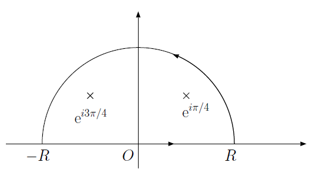

# 第七回 留数定理とその応用

## 目的

留数定理を用いた複素積分と、その応用として実定積分の計算方法を学ぶ。

## 解答

### 22. (1)

$\mathrm{e}^{z}$は正則な関数であるから、公式で$f(z)=\mathrm{e}^z$、$a=-1$と置けばよい。

$$
\begin{aligned}
  \frac{1}{2\pi i} \int_{|z|=2} \frac{\mathrm{e}^z}{z+1} &= f(-1)\\
  &= e^{-1}
\end{aligned}
$$

すなわち、

$$
  \int_{|z|=2} \frac{\mathrm{e}^z}{z+1} = 2\pi i e^{-1}
$$

ここで、積分路が囲む範囲$|z|<2$に、特異点$z=-1$が含まれることに注意しよう。
積分路が特異点を囲まなければ関数$\mathrm{e}^z/(z+1)$は正則となるので
周回積分は$0$である。

### 22. (2)

まず、部分分数分解を行う。

$$
  \frac{z}{z^2+1} = \frac{1}{2} \left( \frac{1}{z+i} + \frac{1}{z-i} \right)
$$

コーシーの積分定理から、

$$
\begin{aligned}
  \int_{|z|=2} \frac{1}{z+i} \mathrm{d} z &= 2 \pi i \\
  \int_{|z|=2} \frac{1}{z-i} \mathrm{d} z &= 2 \pi i \\
\end{aligned}
$$

であるから、

$$
  \int_{|z|=2} \frac{1}{z^2+1} = \frac{2\pi i + 2\pi i}{2} = 2 \pi i
$$

### 23. (1)

$f(z) = \mathrm{e}^{3z}$とおけば、コーシーの積分公式より、

$$
  \frac{1}{2\pi i} \int_{|z|=3} \frac{f(z)}{(z-2)^2} = f'(2) = 3\mathrm{e}^{6}
$$

以上から、

$$
  \int_{|z|=3} \frac{\mathrm{e}^{3z}}{(z-2)^2} = 6 \pi i \mathrm{e}^{6}
$$

### 23. (2)

まず注意したいのは、関数$\displaystyle \frac{1}{z^2(z-3)}$は
特異点として$z=0,3$を持つが、積分範囲$|z|=1$の中にあるのは$z=0$のみである。
したがって、関数$1/(z-3)$は積分領域で正則であるから、
$f(z) = 1/(z-3)$と置けば、

$$
  \frac{1}{2\pi i} \int_{|z|=1} \frac{f(z)}{z^2} = f'(0) = - \frac{1}{9}
$$

したがって、

$$
  \int_{|z|=1} \frac{1}{z^2(z-3)} =- \frac{2 \pi i}{9}
$$

このように、特異点のうち積分に寄与するのは、閉曲線の内部にあるもののみである。
これは、$|z|<3$と、$|z|>3$の二つの範囲で$\displaystyle \frac{1}{z^2(z-3)}$をローラン展開すればより明確に理解できよう。

### 24. (1)

まず、$\mathrm{e}^{iz}$は(無限遠を除いた)すべての領域で正則であることに注意しよう。
したがって特異点は$z = \pm i a$である。
部分分数分解すると、

$$
  \frac{\mathrm{e}^{iz}}{z^2+a^2} = \frac{\mathrm{e}^{iz}}{2ia}
  \left(
  \frac{1}{z-ia} - \frac{1}{z+ia}
  \right)
$$

となる。
$z=ia$の周りで周回積分すると、

$$
  \frac{1}{2\pi i} \int_{|z-ia|=\sigma} \frac{\mathrm{e}^{iz}}{2ia}
  \left(
  \frac{1}{z-ia} - \frac{1}{z+ia}
  \right)
  = \frac{\mathrm{e}^{-a}}{2ia}
$$

以上から、

$$
  \mathrm{Res} f(ia) = \frac{\mathrm{e}^{-a}}{2ia}
$$

同様に、$z=-ia$の周りで周回積分すれば、

$$
  \mathrm{Res} f(-ia) = - \frac{\mathrm{e}^{a}}{2ia}
$$

を得る。

**別解** 留数とは、ローラン展開したときの係数の$c_{-1}$そのものである。
したがって、$f(z)$が$a$を一位の極として持つなら、

$$
  f(z) = c_{-1} (z-a)^{-1} + c_0 + c_1 (z-a) + c_2 (z-a)^2 + \cdots
$$

と展開されるはずである。
そこで、$f(z)(z-a)$をかけてから、極限$\lim z \rightarrow a$を考えると、

$$
  \lim_{z \rightarrow a} f(z)(a-z) = c_{-1}
$$

となり、これは求める留数である。

この方法を問題に適用すると、

$$
  \mathrm{Res} f(ia) = \lim_{z \rightarrow ia} \left( (z-ia) \frac{\mathrm{e}^{iz}}{z^2+a^2} \right)
  = \frac{\mathrm{e}^{-a}}{2ia}
$$

$$
  \mathrm{Res} f(-ia) = \lim_{z \rightarrow -ia} \left( (z+ia) \frac{\mathrm{e}^{iz}}{z^2+a^2} \right)
  = -\frac{\mathrm{e}^{a}}{2ia}
$$

とすぐに求めることができる。
物理数学において複素積分は計算を簡単に行うための便法であるので、
複素積分自体もなるべく簡単に計算ができるように工夫したい。
そのためには典型的なパターンをいくつか覚える必要があるが、今回の例はその一つである。
他には$1/(1-z)$のテイラー展開を利用するものなどがある。

### 24. (2)

特異点は$\mathrm{e}^{i \pi /4}$、$\mathrm{e}^{i 3\pi /4}$、$\mathrm{e}^{-i \pi /4}$、$\mathrm{e}^{-i 3\pi /4}$の４つで、いずれも一位の極である。
部分分数展開しても良いが、前問の別解を使うほうが便利である。

$z = \mathrm{e}^{i \pi /4}$における留数は

$$
  \mathrm{Res} f(\mathrm{e}^{i \pi /4}) = \lim_{z \rightarrow \mathrm{e}^{i \pi /4}} \left( \frac{z-\mathrm{e}^{i \pi /4}}{z^4+1} \right)
  = \frac{\exp{(-3\pi i/4})}{4}
$$

ただし、$f(0)=g(0)=0$の時、

$$
  \lim_{x\rightarrow 0} \frac{f(x)}{g(x)} = \frac{f'(x)}{g'(x)}
$$

を用いた(ロピタルの定理)。
他の留数も同様に求められる。

### 25. (1)

まず、$x^4+1$は偶関数であるから、

$$
  \int_0^{\infty} \frac{1}{x^4+1} \mathrm{d} x = \frac{1}{2} \int_{-\infty}^{\infty}  \frac{1}{x^4+1} \mathrm{d} x
$$

として、以下の図のような積分路$C$を考える。

半円の積分路。$R$は無限大にする。
  
ここで、$\lim R \rightarrow \infty$の極限で、半円の部分の積分の寄与は$0$となる(解説参照)。
したがって、

$$
  \int_{-\infty}^{\infty} \frac{1}{x^4+1} \mathrm{d} x = \lim_{R \rightarrow \infty} \int_C \frac{1}{z^4+1} \mathrm{d} z
$$

ここで、積分路の内部にある特異点は$z = \mathrm{e}^{i\pi/4},\mathrm{e}^{i3\pi/4}$の二つであるから、

$$
\begin{aligned}
  \int_C \frac{1}{z^4+1} \mathrm{d} z &= 2 \pi i \left( \mathrm{Res} f(\mathrm{e}^{\pi i/4}) +\mathrm{Res} f(\mathrm{e}^{3\pi i/4})  \right)\\
  &= 2 \pi i \left(  \frac{\exp{(-3\pi i /4})}{4} + \frac{\exp{(-9 \pi i /4})}{4}  \right)\\
  &= 2 \pi i \left(  \frac{\mathrm{e}^{\pi i/4}-\mathrm{e}^{- \pi i/4}}{4}  \right)\\
  &= \pi \sin \frac{\pi}{4}
\end{aligned}
$$

以上より、

$$
  \int_0^{\infty} \frac{1}{x^4+1} \mathrm{d} x = \frac{\pi}{2} \sin \frac{\pi}{4} = \frac{\pi}{2\sqrt{2}}
$$

### 25. (2)

$f(z) = \mathrm{e}^{ikz}/(z^2+1)$とし、以下の複素積分を考える。

$$
  \int_C \frac{e^{ikz}}{z^2+1} \mathrm{d} z
$$

まず、$f(z)$の上半面内の特異点は$z=i$のみであるので、

$$
\begin{aligned}
  \int_C \frac{e^{ikz}}{z^2+1} \mathrm{d} z &= 2\pi i ~\mathrm{Res} f(i)\\
  &= 2\pi i \left( \frac{\mathrm{e}^{-k}}{2i} \right) \\
  &= \pi \mathrm{e}^{-k}
\end{aligned}
$$

以上から、

$$
  \int_{-\infty}^{\infty} \frac{\cos kx}{x^2+1} \mathrm{d} x =
  \mathrm{Re} \int_C \frac{\mathrm{e}^{ikz}}{z^2+1} \mathrm{d} z = \pi \mathrm{e}^{-k}
$$

## 解説

### コーシーの積分定理

複素関数が微分可能であるとき、その実部と虚部には
強い制限(コーシー・リーマンの関係式)が課せられるのであった。
その帰結として、以下のコーシーの積分定理が成り立つ。

関数$f(z)$が領域$D$で正則であるとする。$C$は$D$内の単一閉曲線で、
$C$の内部が$D$の点のみであるとき、

$$
  \int_C f(z) \mathrm{d} z = 0
$$

が成り立つ。すなわち、 **正則な関数を周回積分すると値が$0$となる** 。
この積分定理と関数の正則性から、以下のコーシーの積分公式が導かれる。

関数$f(z)$は領域$D$であり、$C$は内部に領域$D$の点のみを持つ単一閉曲線である。
このとき、$C$内の点$a$について、以下の公式が成り立つ。

$$
  f(a) = \frac{1}{2\pi i} \int_C \frac{f(z)}{z-a} \mathrm{d} z 
$$

これは、$C$の内部の任意の点$a$での値$f(a)$が$C$上の$f(z)$の値だけで決まる、
すなわち、 **境界の値からその内部の値がすべて決まることを意味している** 。
さらに以下の公式が成り立つ(これもコーシーの積分公式と呼ばれる)。

$$
  f^{n}(a) = \frac{n!}{2\pi i} \int_C \frac{f(z)}{(z-a)^{n+1}} \mathrm{d} z  
$$

すなわち、 **積分の値が微分から求められる** 。
これらの性質はすべて、複素関数が微分可能(正則)であるという条件が厳しいからである。
ここで、式(\ref{eq_cauchy2})は、式(\ref{eq_cauchy1})を形式的に左右$a$で微分した形に
なっていることに注意しよう。

さて、なぜコーシーの積分定理が成り立つか考えよう。
まず、$(z-a)^n$を$a$の周りに周回積分すると、その半径にかかわらず

$$
\begin{aligned}
  \int_{|z-a|=r} (z-a)^n \mathrm{d} z=
  \left\{
  \begin{array}{ccc}
     & 0      & (n \neq -1) \\
     & 2\pi i & (n = -1)
  \end{array}
  \right.
\end{aligned}
$$

となるのであった。
また、$f(z)$が考えている領域で正則であるならば、

$$
  f(z) = f(a) + f'(a) (z-a) + \frac{f''(a)(z-a)^2}{2} + \cdots
$$

と$a$の周りでテイラー展開できる。
したがって、

$$
  \frac{f(z)}{z-a} = \frac{f(a)}{z-a} + f'(a) + \frac{f''(a)(z-a)}{2} + \cdots
$$

となるから\footnote{
  これは$f(z)/(z-a)$の$a$におけるローラン展開である。
}、周回積分すれば、$1/(z-a)$の係数のみが残るので、

$$
  \int_C \frac{f(z)}{z-a} \mathrm{d} z = 2\pi i f(a)
$$

と、コーシーの積分公式を得た。
同様に$f(z)/(z-a)^{n+1}$の展開を考えることで公式(\ref{eq_cauchy2})も得ることができる。
記憶する便法として、$a$による形式的な微分をしても良いが、
ローラン展開をして$1/(z-a)$の係数を求めているのが本質であることを理解して欲しい。

### 実定積分への応用

複素積分は、実関数の定積分の値を求めるのに用いることができる。
複素積分を用いるのは、原始関数は求められないが、ある特別な区間においては定積分の値が求まる場合と、
原始関数が求められる場合でも複素積分を用いたほうが計算が簡単である場合がある。

物理数学において出てくる積分のパターンには、まず

$$
  \int_{-\infty}^{\infty} \frac{f(x)}{g(x)} \mathrm{d} x
$$

というタイプがある。ただし$f(x)$、$g(x)$はそれぞれ$m$次と$n$次の多項式であり、
$m\le n + 2$を満たすとする。さらに$g(x)=0$は実数解を持たないとする。

まず、前者の場合は、
積分路$C$を図\ref{fig_z_int2}のように半円型にとり、
複素積分

$$
  \lim_{R \rightarrow \infty}\int_C \frac{f(z)}{g(z)} \mathrm{d} z
$$

を考えるのが定石。ここで、円周の積分は半径$R$を無限大にすれば$0$となる。
それは、$f(z)$が$m$次、$g(z)$が$n$次の多項式であり、
$m\le n + 2$を満たすことから、$\lim |z| \rightarrow \infty$において

$$
  \left| \frac{f(z)}{g(z)} \right| \leq \frac{1}{|z|^2}
$$

を満たす。
したがって、半径$R$の円周上$C_1$において

$$
\begin{aligned}
  \int_{C_1} \frac{f(z)}{g(z)} \mathrm{d} z &\leq& \int_{C_1} \left| \frac{f(z)}{g(z)} \right| \mathrm{d} z \\
  &\leq& \int_{C_1}  \frac{1}{|z|^2} \mathrm{d} z\\
  &= & \frac{1}{R}
\end{aligned}
$$

以上から、$R \rightarrow \infty$の極限で、円周上の積分の寄与が$0$になるのである。
逆に、$|z| \rightarrow \infty$の極限に対して、$1/z^2$より早く$0$になる
複素関数でなければ、円周上の積分を$0$とおいてはいけない。

さて、円周の積分が$0$であるから、「実軸の積分」は「実軸を含む周回積分」と等しいことがわかる。
ここで、複素関数の周回積分は留数定理で簡単に値を求めることができる。
以上より実関数の定積分が複素積分により求められるのである。

複素積分を使った実定積分には、もう一つ

$$
  \int_{-\infty}^{\infty} \frac{f(x)\cos(kx)}{g(x)} \mathrm{d} x
$$

というパターンがある。ただし、$f(x)$と$g(x)$
それぞれ$m$次と$n$次の多項式であり、
$m\le n + 1$を満たすとする。さらに$g(x)=0$は実数解を持たないとする。

これは複素関数$F(z)$として、

$$
  F(z) =  \frac{f(z) \mathrm{e}^{ikz}}{g(z)}
$$

を考えるのが定石である。
これについて複素積分を実行し、後で実部をとればよい。$\sin$の場合も同様に積分後に虚部を取る。

