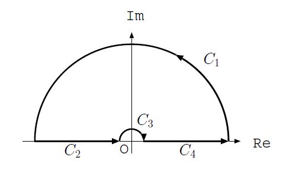
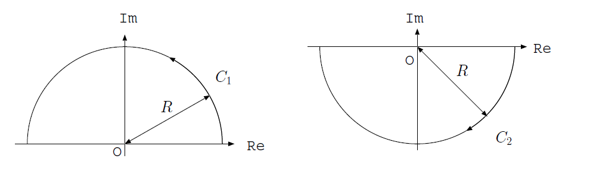

# 第八回 フーリエ逆変換とジョルダンの補題

## 目的

フーリエ逆変換を行う際、複素積分の積分路をどのように取るべきかを学ぶ。

## 解答

### 26. (1)

フーリエ変換の定義より、

$$
\begin{aligned}
  \hat{f}(k) &= \int_{-\infty}^{\infty} f(x) \mathrm{e}^{-ikx} \mathrm{d} x \\
  &= \int_{-a}^{a} \mathrm{e}^{-ikx} \mathrm{d} x \\
  &= \left[ \frac{\mathrm{e}^{-ikx}}{-ik}  \right]_{-a}^a\\
  &= \frac{1}{ik} \left( \mathrm{e}^{ika} - \mathrm{e}^{-ika} \right)
\end{aligned}
$$

複素積分を行うための積分路。
全体の積分路$C = C_1+C_2+C_3+C_4$は、積分路に特異点が無いから$0$。$(x+a)>0$であれば、十分大きな半径のとき$C_1=0$となる。また、$C_3$は、半径$0$の極限で$-\pi i $であり、求めたい積分は

$$
\int_{-\infty}^{\infty} = \int_{C_2}+\int_{C_4} = -\int_{C_3}
$$

から求まる。$(x+a)<0$の場合は下半面を回らなくてはいけない。
 
### 26. (2)

逆フーリエ変換の定義から、

$$
\begin{aligned}
  f(x) &= \frac{1}{2\pi} \int_{-\infty}^{\infty} \hat{f}(k) \mathrm{e}^{ikx} \mathrm{d} k \\
  &= \frac{1}{2\pi i}\int_{-\infty}^{\infty} \left( \frac{\mathrm{e}^{i(x+a)k}}{k} - \frac{\mathrm{e}^{i(x-a)k}}{k} \right) \mathrm{d} k
\end{aligned}
$$

まず、第一項の積分を計算する。$x+a>0$の場合、
積分路$C$を図\ref{fig_jordan2}
$C = C_1 + C_2 + C_3 + C_4$のように取る。
$C$の中には極が無いから、

$$
  \int_{C} \frac{\mathrm{e}^{i(x+a)z}}{z} \mathrm{d} z = 0
$$

ジョルダンの補題より大きな半径を取れば$C_1= 0$である。
また、積分路$C_3$は、一位の極を時計回りに半分だけ回っているから

$$
  \int_{C_3} \frac{\mathrm{e}^{i(x+a)z}}{z} \mathrm{d} z = - \pi i
$$

である。以上から、

$$
\begin{aligned}
  \int_{C_1+C_2+C_3+C_4} \frac{\mathrm{e}^{i(x+a)k}}{k} \mathrm{d} k &= &0 \\
  \int_{C_2+C_4} \frac{\mathrm{e}^{i(x+a)k}}{k} \mathrm{d} k - \pi i &= &0 \\
  \therefore \int_{-\infty}^{\infty} \frac{\mathrm{e}^{i(x+a)k}}{k} \mathrm{d} k &= \pi i
\end{aligned}
$$

同様に、$x+a <0$の時には、

$$
  \int_{C_2} \frac{\mathrm{e}^{i(x+a)z}}{z} \mathrm{d} z = - \pi i
$$

となる。

まとめると、

$$
  \int_{-\infty}^{\infty} \frac{\mathrm{e}^{i(x+a)k}}{k} \mathrm{d} k =
  \left\{
  \begin{array}{cc}
    \pi i  & \quad (x > -a) \\
    -\pi i & \quad (x < -a)
  \end{array}
  \right.
$$

積分の第二項も同様に、

$$
  \int_{-\infty}^{\infty} \frac{\mathrm{e}^{i(x-a)k}}{k} \mathrm{d} k =
  \left\{
  \begin{array}{cc}
    \pi i  & \quad (x>a) \\
    -\pi i & \quad (x<a)
  \end{array}
  \right.
$$

以上をまとめると、

$$
  f(x) = \left\{
  \begin{array}{cc}
    0 & \quad x < -a        \\
    1 & \quad -a \leq x < a \\
    0 & \quad a \leq x
  \end{array}
  \right.
$$

となり、確かに元の関数に一致する。

### 27. (1)

全体をフーリエ変換すると、

$$
  (ik)^2 \hat{f} - \hat{f} = {\mathcal F}[\mathrm{e}^{-|x|}]
$$

ここで、

$$
\begin{aligned}
  {\mathcal F}[\mathrm{e}^{-|x|}] &=
  \int_{-\infty}^{\infty} \mathrm{e}^{-|x|} e^{-ikx} \mathrm{d} x\\
  &=
  \int_{-\infty}^{0} \mathrm{e}^{x} e^{-ikx} \mathrm{d} x +
  \int_{0}^{\infty} \mathrm{e}^{-x} e^{-ikx} \mathrm{d} x \\
  &= \frac{1}{1-ik} + \frac{1}{1+ik}\\
  &= \frac{2}{1+k^2}
\end{aligned}
$$

以上から、

$$
  \hat{f}(k) = - \frac{2}{(1+k^2)^2}
$$

### 27. (2)

逆フーリエ変換の定義より、

$$
  f(x) = - \frac{1}{2\pi} \int_{-\infty}^{\infty}  \frac{\mathrm{e}^{ikx}}{(1+k^2)^2} \mathrm{d} k
$$

$x>0$のとき、複素平面の上を通る半円を積分路とすると、

$$
  \int_{-\infty}^{\infty}  \frac{\mathrm{e}^{ikx}}{(1+k^2)^2} \mathrm{d} k
  = \int_C  \frac{\mathrm{e}^{ixz}}{(1+z^2)^2} \mathrm{d} z
$$

このとき、積分路の中に、2位の極$z = i$があるから、
$F(z) = \displaystyle \frac{2 \mathrm{e}^{ixz}}{(z+i)^2}$とすれば、

$$
\begin{aligned}
  \int_C  \frac{\mathrm{e}^{ixz}}{(1+z^2)^2} \mathrm{d} z &= \int_C  \frac{F(z)}{(z-i)^2} \mathrm{d} z \\
  &= 2 \pi i F'(i) \\
  &= \frac{2\pi (1+x)}{2} \mathrm{e}^{-x}
\end{aligned}
$$

すなわち、

$$
  f(x) = - \frac{(1+x)}{2} \mathrm{e}^{-x}
$$

同様に、$x<0$のときは

$$
  f(x) = - \frac{(1-x)}{2} \mathrm{e}^{x}
$$

まとめると、

$$
  f(x) = - \frac{(1+|x|)}{2} \mathrm{e}^{-|x|}
$$

### 27. (3)

$x>0$のとき、

$$
\begin{aligned}
  f(x) &= -\frac{(1+x)}{2}e^{-x}\\
  \frac{\mathrm{d}}{\mathrm{d} x} f(x) &= \frac{x}{2}e^{-x}\\
  \frac{\mathrm{d}^2}{\mathrm{d} x^2}  f(x) &= \frac{(1-x)}{2}e^{-x}\\
\end{aligned}
$$

以上から、

$$
  \frac{\mathrm{d}^2}{\mathrm{d} x^2}  f(x) - f(x) = \mathrm{e}^{-x}
$$

$x<0$の場合も同様。

## 解説

関数$f(x)$のフーリエ変換$\hat{f}(k)$が存在するためには、積分

$$
  \int_{-\infty}^{\infty} |f(x)|  \mathrm{d} x
$$

が有限でなくてはならない。これを **絶対可積分** であるという。
フーリエ変換が可能である条件は、$f(x)$が区分的に滑らかで、
絶対可積分であることである。

さて、フーリエ逆変換は、以下の積分で与えられる。

$$
  f(x) = \frac{1}{2\pi}\int_{-\infty}^{\infty} \hat{f}(k) \mathrm{e}^{ikx} \mathrm{d} k
$$

さて、この積分を、複素積分を用いて

$$
  f(x) = \frac{1}{2\pi} \int_{C} F(z) \mathrm{e}^{ixz} \mathrm{d} z
$$

を用いて計算したい。このとき、積分路$C$をどのように決めるべきだろうか。
ただし、$|z| \rightarrow \infty$において$F(z) \rightarrow 0$であるとする。
複素積分においては、半円形の積分路が良く取られるが、
半円の半径$R$を十分大きくしたときに半円の積分の寄与が$0$になる必要がある。

まず、積分路を図\ref{fig_jordan}の$C_1$(複素平面の上半分の半円)のように取ることを考える。
$u,i$を実数とし、$z = u + iv$としよう。

$$
  |\mathrm{e}^{ixz}| = |\mathrm{e}^{ixu - vx}| = \mathrm{e}^{- vx}
$$

であるから、$v \rightarrow \infty$、すなわち虚軸の上の方で
$\mathrm{e}^{ixz}$が$0$となるためには、$x>0$でなくてはならない。
逆に$x<0$の時には、$\displaystyle \lim_{\mathrm{Im} z \rightarrow \infty} \mathrm{e}^{ixz} \rightarrow \infty$となるため、
積分路を$C_2$のように取らなくてはいけない。

以上をまとめて、

$$
\begin{aligned}
  \lim_{R\rightarrow \infty}  \int_{C_1} F(z) \mathrm{e}^{iaz} \mathrm{d} z &= 0 \qquad (a>0)\\
  \lim_{R\rightarrow \infty}  \int_{C_2} F(z) \mathrm{e}^{iaz} \mathrm{d} z &= 0 \qquad (a<0)
\end{aligned}
$$

を **ジョルダンの補題** という。これはフーリエ逆変換を行う際、
積分路をどのように決めるべきかを考える上で重要である。

ジョルダンの補題。$F(z)\mathrm{e}^{ikx}$の積分においては、$x$の値によって積分路を変える必要がある。$x>0$の場合は$C_1$(上半面)を、$x<0$の場合は$C_2$(下半面)を通る積分路を取る。
